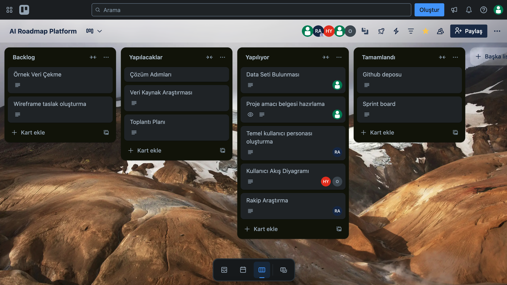
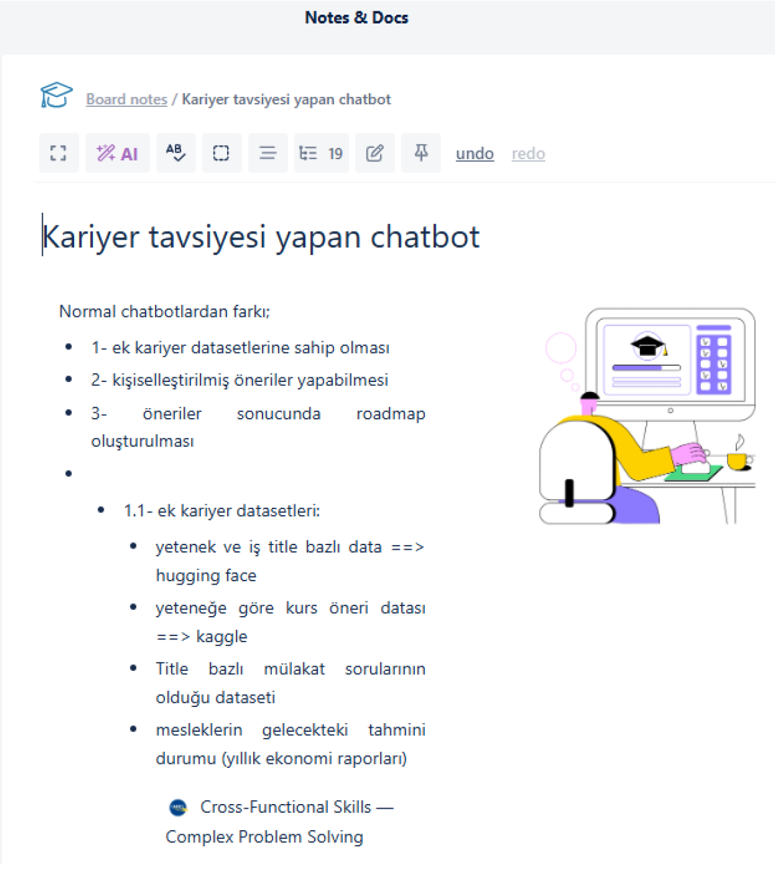
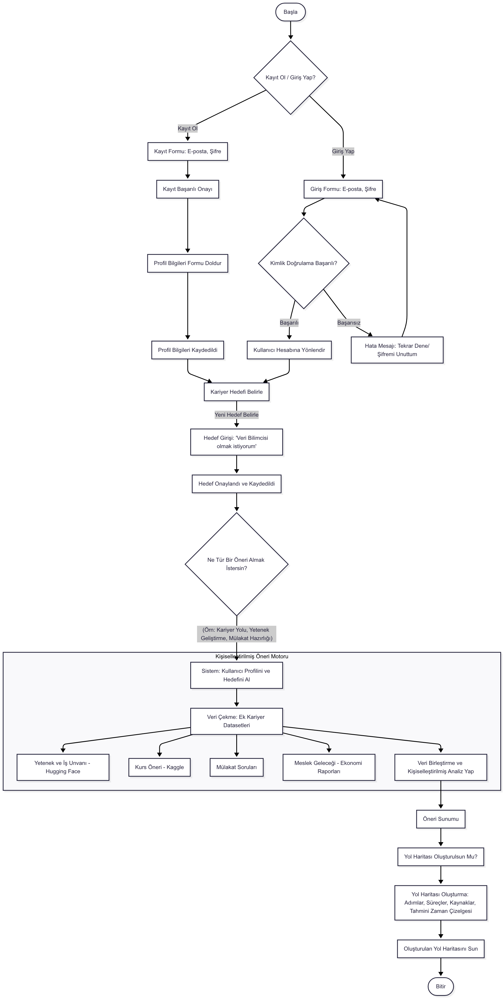

# Sprint 1 Raporu
## Ürün Adı: AI Roadmap Platform 
Kullanıcıdan alınan bilgiler (eğitim durumu, yazılım dilleri, hedefler, dil seviyesi, çalışma tercihi vb.) ışığında kişiye özel yapay zekâ tabanlı bir kariyer yol haritası oluşturmayı amaçlayan bir platformdur.
##  Takım: Yapay Zeka Grup 41

## Takım Üyeleri

<table>
  <tr>
    <td align="center">
       
      <strong>Rümeysa Acar</strong> 
      Scrum Master 
      <a href="https://www.linkedin.com/in/rumeysaacar/">LinkedIn</a>
    </td>
    <td align="center">
       
      <strong>Muhammed Selim Özlen</strong> 
      Product Owner 
      <a href="https://www.linkedin.com/in/selim-ozlen/">LinkedIn</a>
    </td>
    <td align="center">
       
      <strong>Zehra Nur Öztürk</strong> 
      Developer 
      <a href="https://www.linkedin.com/in/zehranur%C3%B6zt%C3%BCrk/">LinkedIn</a>
    </td>
    <td align="center">
       
      <strong>Hatice Yalçın</strong> 
      Developer 
      <a href="https://www.linkedin.com/in/haticeyalcinn/">LinkedIn</a>
    </td>
    <td align="center">
       
      <strong>Mert Can Obalı</strong> 
      Developer 
      <a href="https://www.linkedin.com/in/mert-can-obal%C4%B1/">LinkedIn</a>
    </td>
  </tr>
</table>

##  Sprint 1 Notları

- Proje yönetimi için **Trello** kullanılmasına karar verilmiştir.
- Yetenek–pozisyon eşleştirmesi için Hugging Face veri setleri kullanılacaktır.
- Yeteneklere göre kurs önerileri için Kaggle veri setlerinden faydalanılacaktır.
- Mülakat soruları için meslek bazlı özel veri seti planlanmaktadır.
- Mesleklerin gelecekteki durumu için yıllık ekonomi raporları değerlendirilecektir.
- Kullanıcıdan alınacak bilgiler için bir form hazırlanacaktır (eğitim durumu, yazılım dilleri, hedefler, dil seviyesi, çalışma tercihi vb.)
- Bu bilgilerden yola çıkarak kişiselleştirilmiş öneriler sunulacak ve kullanıcıya bir roadmap oluşturulacaktır.

## Sprint İçinde Tamamlanması Tahmin Edilen Puan
100 puan

## Puan Tamamlama Mantığı
Toplam proje sürecinde yaklaşık 300 puanlık iş planlanmıştır. Bu puan, 3 sprint'e bölünerek her sprint için yaklaşık 100 puanlık hedefler belirlenmiştir. Sprint 1 için hedef 100 puan olup; proje vizyonu, araç seçimi ve temel yapının hazırlanmasına ayrılmıştır.
- **Toplam Proje Puanı:** 300 puan → 3 Sprint’e bölündü.
- Sprint 1 için hedef 100 puan olup; proje vizyonu, araç seçimi ve temel yapının hazırlanmasına ayrılmıştır.
  

## Daily Scrum
Daily Scrum toplantıları Cuma günleri Google Meet üzerinden yapılmıştır. Daily Scrum toplantısı örneğine aşağıdaki bağlantıdan ulaşabilirsiniz.
📎 [Toplantı Örneği Bağlantısı](https://yapayzekagrup41.notion.site/)

## Sprint Board Özeti: Sprint Board Ekran Görüntüsü

  

Sprint board, Trello üzerinde dört sütun hâlinde yapılandırılmıştır: Backlog, Yapılacaklar, Yapılıyor, Tamamlandı. Her bir sütun, product backlog’tan seçilen story’lerin ve bu story’lere bağlı task’ların durumlarını yansıtmaktadır. Story’ler, geliştirme sürecini daha verimli yönetmek adına daha küçük iş parçacıkları olan task’lara bölünmüştür.

## ✅ Tamamlananlar

- Proje konusu belirlendi.
- GitHub reposu oluşturuldu.
- Sprint board yapılandırıldı.
- Dataset araştırması yapıldı.
- Proje amacı belgesi hazırlandı.

  

## Sprint Review
- Dataset’lerin uygunluğunun test edilmesine karar verildi (Hugging Face, Kaggle).
- Wireframe detayları bir sonraki sprint’e aktarıldı.
-Bu sprintte teknik geliştirme yerine araştırma ve yapılandırmaya odaklanıldı.

## Sprint Retrospective
- Araştırma görevleri için başlangıçta zaman tahmini zor oldu, bu nedenle sonraki sprint’te task'lar daha küçük parçalara bölünerek planlanacak.
- Daily Scrum’lar ekip içi iletişimi olumlu etkiledi.
- Bir sonraki sprint’te uygulama geliştirme önceliklendirilecek.

## 📝 Kararlaştırılan Görev Dağılımı

| Takım Üyesi              | Görevler                                                                 |
|--------------------------|--------------------------------------------------------------------------|
| **Rümeysa Acar**         | Scrum yönetimi, toplantı koordinasyonu, rakip araştırması, temel kullanıcı personası oluşturma |
| **Zehra Nur Öztürk**     | Proje amacı belgesi hazırlama, Sprint 1 raporlaması                      |
| **Muhammed Selim Özlen** | Dataset araştırması, veri kaynaklarının belirlenmesi                     |
| **Hatice Yalçın**        | Kullanıcı akış diyagramı                                                 |
| **Mert Can Obalı**       | Kullanıcı akış diyagramı                                                 |

## Sprint 2 

## Sprint Hedefi : 
Sprint içinde tamamlanması hedeflenen görevler:
- Dataset analiz ve ön işleme (20 puan)
- Rakip analizi dokümanı oluşturma (20 puan)
- Personaların oluşturulması ve onaylanması (15 puan)
- Kullanıcı akış diyagramının hazırlanması (15 puan)
- AI öneri sistemi mantığının belirlenmesi (30 puan)
Toplam: 100 puan

 ## Daily Scrum :
Sprint 2 sürecinde resmi Daily Scrum toplantıları gerçekleştirilmemiştir.
Ancak takım üyeleri arasında sürekli iletişim halinde olunmuş ve her üye kendi sorumluluğundaki işleri günlük olarak raporlamıştır.

WhatsApp üzerinden yürütülen yazışmalar yoluyla temel görev takibi sağlanmış, major bir iletişim problemi yaşanmamıştır.
Sprint 3’te ise, daha disiplinli bir Scrum yapısına geçilerek her gün sabit saatte kısa toplantıların yapılması planlanmaktadır. 

## Kullanılacak Datasetler :
Proje süresince kullanılacak olan veri setleri :  

[1- Job Skill Set Dataset – batuhanmtl (HuggingFace)](https://huggingface.co/datasets/ASNVS/jobs_skill_based)

[2- IT Job Roles, Skills & Certifications Dataset – NxtGenIntern (HuggingFace)](https://huggingface.co/datasets/NxtGenIntern/IT_Job_Roles_Skills_Certifications_Dataset)

[3- Jobs Skill-Based Dataset – ASNVS (HuggingFace)](https://huggingface.co/datasets/batuhanmtl/job-skill-set)

## Proje Amacı:
Yapay zeka destekli bir kariyer yol haritası platformu geliştirerek, kullanıcının yeteneklerine ve hedeflerine göre eğitim, sertifika ve pozisyon önerileri sunmak.
(Ayrıntılar için bkz: AI Roadmap Proje Amacı Raporu)
## 📄 Proje Dokümanları

- [AI Roadmap Proje Amacı Raporu](./AI_Roadmap_Proje_Amacı_Raporu.pdf)

## Temel Kullanıcı Personaları 
Elif Yılmaz – 23 yaşında, yeni mezun bir genç. Mezuniyet sonrası hangi sertifikaları alması gerektiğini ve nasıl bir kariyer yolu çizmesi gerektiğini bilmek istiyor.

Mehmet Demir – 29 yaşında, 6 yıllık tecrübeye sahip bir beyaz yaka. Mevcut işinden memnun değil, yazılıma yönelmek istiyor. Uygulamanın sunduğu yeniden eğitim ve pozisyon önerilerine ihtiyaç duyuyor.

[Detaylı persona dokümanını buradan inceleyebilirsiniz(PDF)](./Temel_Personalar.pdf)

## Kullanıcı Akış Diyagramı

Bu diyagram, platforma gelen bir kullanıcının yolculuğunu baştan sona kadar adım adım göstermektedir. 
Kullanıcının sisteme giriş yapmasından, yetenek analizi sonucunda kişiselleştirilmiş bir kariyer yol haritası elde etmesine kadar olan süreci kapsamaktadır.

## Rakip Analizi

Aşağıdaki tablo, benzer hizmetler sunan bazı platformların temel özelliklerini ve bizim çözümümüzden farklarını özetlemektedir:

| Platform                         | Güçlü Yönleri                                              | Eksikleri / Sınırları                                       | AI Roadmap Farkı                             |
|----------------------------------|------------------------------------------------------------|-------------------------------------------------------------|----------------------------------------------|
| **LinkedIn Career Explorer**     | Bağlantı Ağı ve veri zenginliği                            | Sadece Linkedln kariyer geçmişi ile sınırlı                 | AI ile yönlendirme + eğitim eşleşmesi        |
| **Rezi**                         | AI destekli CV oluşturma                                   | Yol haritası veya analiz sistemi yok                        | Yetkinlik analizi + yol haritası sunuyor     |
| **Google Career Pathways**       | Sertifikalı eğitim, Google onaylı içerikler                | Sadece Google'ın sunduğu kurslar                            | AI ile bireysel plan oluşturuyor             |
| **Jobiri**                       | CV & mülakat koçluğu, iş başvuru desteği                   | Kapsamlı roadmap mantığı yok                                | Kapsayıcı, AI tabanlı yönlendirme sağlıyor   |

📄 [Detaylı Rakip Analizi Dokümanını Görüntüle (PDF)](./competitive_analysis.pdf)

